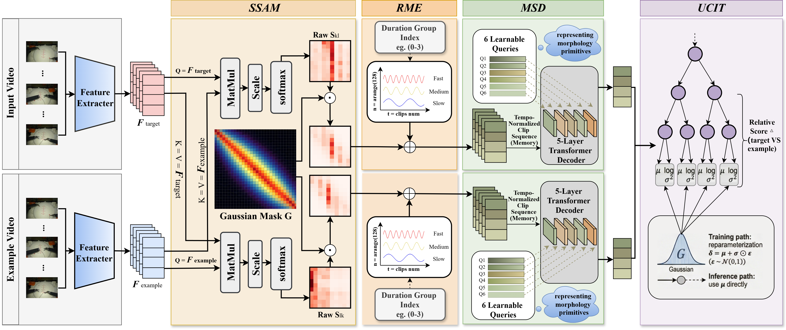

# R-MSA: Rhythm-Conditioned Surgical Video Skill Assessment via Morphology Synchronization and Uncertainty Calibration

Official implementation of R-MSA: Rhythm-Conditioned Surgical Video Skill Assessment (MICCAI 2026)



## Introduction

We propose R-MSA (Rhythm--Morphology Synchronous Assessment), a rhythm-aware framework that explicitly inherent models execution rhythm differences. Specifically, a Rhythm Morphology Encoder performs duration-conditioned rhythm encoding to generate rhythm-adaptive representations for variable-length videos. A Morphology-Synchronous Decoder with learnable queries aligns latent morphology primitives (e.g., needle driving, knot tying) across rhythm-normalized sequences. To refine procedural correspondence, a Surgical Sequence Alignment Module integrates a Gaussian temporal prior into co-attention for localized temporal alignment. Finally, an Uncertainty-Calibrated Interpretable Tree produces relative skill scores with calibrated uncertainty through reparameterized prediction. Experiments on JIGSAWS, HeiChole, and our proposed Kangduo datasets show that R-MSA consistently outperforms state-of-the-art methods in ranking correlation and error metrics.

## Installation

### Requirements

Create a Python environment and install the required dependencies:

```bash
pip install -r requirements.txt
```

### Pre-trained Weights

Download the pre-trained I3D model weights and place them in the `models/` directory:

- I3D RGB model: `models/model_rgb.pth`

You can download the pre-trained I3D weights from [here](https://github.com/piergiaj/pytorch-i3d).

## Data Preparation

### JIGSAWS Dataset

1. Download the JIGSAWS dataset from the [official website](https://cirl.lcsr.jhu.edu/research/hmm/datasets/jigsaws_release/)
2. Extract video frames at the desired frame rate
3. Organize the data structure as follows:

```
JIGSAWS/
├── frames/
│   ├── Knot_Tying_B001_capture1/
│   │   ├── 000001.jpg
│   │   ├── 000002.jpg
│   │   └── ...
│   └── ...
└── info/
    ├── label.pkl
    └── splits.pkl
```

4. Update the dataset paths in the configuration file `configs/JIG.yaml`:
   - `frames_dir`: Path to the extracted frames
   - `info_dir`: Path to the annotation files

### HeiChole Dataset

The HeiChole dataset is a large-scale laparoscopic cholecystectomy surgery dataset containing 24 complete surgical videos with skill annotations. Download the HeiChole dataset from [Synapse](https://www.synapse.org/HeiChole)

### Kangduo Dataset

Kangduo is our high-definition robotic suturing dataset comprising 104 realistic training videos. Unlike JIGSAWS, it exhibits significant execution duration variance (±14 mins), enabling robust rhythm-aware evaluation.

1. Download the pre-extracted features from [Google Drive](https://drive.google.com/drive/folders/1YI_gTlgrRx93FQdwAmcVZg93xe2DEo8Z?usp=sharing)
   - **Note**: The provided dataset contains pre-extracted I3D features, so you can directly use them for training without frame extraction
2. Organize the feature files following the project structure
3. Update the dataset paths in the corresponding configuration file

## Training


We provide three cross-validation modes for the JIGSAWS dataset:

#### 1. 4-Fold Cross-Validation

```bash
bash ./scripts/train.sh 0 JIG try
```

#### 2. LOUO (Leave-One-User-Out) Cross-Validation

```bash
bash ./scripts/run_louo.sh 0 JIG try
```

#### 3. LOSO (Leave-One-Subject-Out) Cross-Validation

```bash
bash ./scripts/run_loso.sh 0 JIG try
```

**Arguments:**
- First argument (`0`): GPU ID
- Second argument (`JIG`): Dataset name (options: `JIG`, `Hei`, `Kang`)
- Third argument (`try`): Experiment name


<!-- ## Citation

If you find this work useful for your research, please consider citing:

```bibtex
@article{your_paper,
  title={CoRe-Rhythmer: Contrastive Regression with Rhythm Encoding for Surgical Skill Assessment},
  author={Your Name},
  journal={Conference/Journal Name},
  year={2024}
}
``` -->

## Acknowledgements

This work builds upon several excellent open-source projects:

- [I3D PyTorch Implementation](https://github.com/piergiaj/pytorch-i3d)
- [CoRe](https://github.com/yuxiangwei0808/CoRe-CVPR2024) - Contrastive Regression framework
- [JIGSAWS Dataset](https://cirl.lcsr.jhu.edu/research/hmm/datasets/jigsaws_release/)


